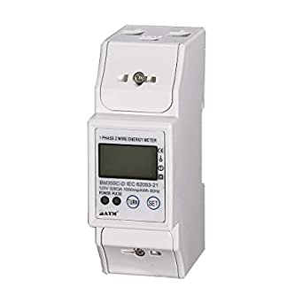

A prometheus exporter for the [BAYM 5(80) remote kWh energy monitor](https://www.amazon.ca/Single-Digital-Modbus-Din-Rail-Multi-Function/dp/B07YWNVQ62/).

The BAYM 5(80) monitors a circuit, reporting the voltage, amperage, power of
the circuit (among other statistics). Monitoring a circuit can provide an
indication of the health of the devices powered by the circuit.

Compiling
=========

Compile the libmodbus and prometheus-cpp libraries with:

    $ ./build-libmodbus.sh && ./build-prometheus-cpp.sh

Then run

    $ Make

Running
=======

Presuming your rs458 port is exposed on `/dev/ttyUSB0`:

    $ ./powermonitoring /dev/ttyUSB0

Testing
=======

Build the java dependencies with

    $ cd test/integration && ./build-prometheus-scraper.sh

And run the tests with:

    $ cd test/integration && make

The java code runs a simulation of the BAYM 5(80), which allows developers which
don't have the BAYM 5(80) to work on the project.

Further Work
============

This repository hasn't been setup as an idiomatic git repository. The
`civetweb`, `prometheus-cpp`, and `libmodbus` libraries are included as `tar.gz`
files instead of as linked git submodule. This is a hold over from an earlier
version of this project, when it was still being prototyped. It would be very
useful to use git submodules and cmake.

